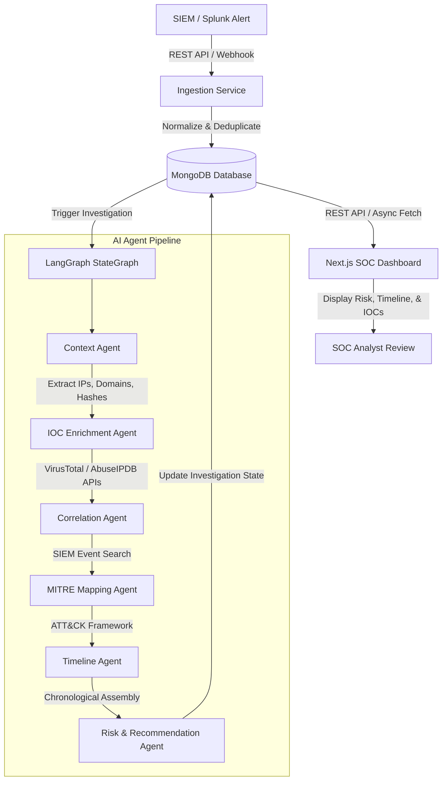

# 🛡️ Forensiq 
**AI-Agent Driven Security Operations & Investigation Platform**


**Forensiq** is an end-to-end AI-Agent Driven Security Operations Center (SOC) platform designed to eliminate alert fatigue, resolve manual investigation bottlenecks, and accelerate threat response. By deploying an automated, multi-agent AI pipeline using LangGraph, Forensiq ingests, enriches, correlates, and analyzes security alerts in real-time.

---

## 🎯 The Problem & Our Solution

### The Problem
Traditional SOC teams face thousands of security alerts daily from SIEM tools like Splunk. Analysts spend hours manually searching logs, querying threat intelligence feeds (VirusTotal, AbuseIPDB), mapping attack patterns to the MITRE ATT&CK framework, and writing incident reports.

### The Forensiq Solution
Forensiq automates the entire triage and investigation pipeline:
1. **Ingest Alerts** directly from SIEM platforms (Splunk).
2. **Orchestrate AI Agents** using **LangGraph** to autonomously extract indicators of compromise (IOCs), query threat intel feeds, map attack tactics, and calculate risk.
3. **Single-Pane-of-Glass Dashboard** built with Next.js for SOC analysts to review AI findings, attack timelines, and actionable recommendations.
4. **Automated Evidence Generation** for leadership and audit trails.

---

## 🏗️ System Architecture & Workflow

Forensiq is built as a clean monorepo containing a Python FastAPI backend and a Next.js frontend.



---

## 🧩 Detailed Pipeline Breakdown

### 1. SIEM Integration & Alert Ingestion
* **Protocol Abstraction**: A `SIEMProvider` interface allows seamless switching between Splunk, Elastic, Microsoft Sentinel, or QRadar.
* **Splunk Client**: Wraps Splunk's REST API, creates search jobs, polls for results, and normalizes raw Splunk events into a canonical schema.
* **Ingestion Service**: Fetches alerts, extracts critical host/user attributes, prevents duplicates, and saves canonical alert objects into MongoDB.

### 2. AI Agent Pipeline (LangGraph)
The core intelligence engine uses **LangGraph** to pass state sequentially across specialized AI agents:
* **Context Agent**: Parses raw payloads to extract IPs, domains, query names, user IDs, hostnames, and process IDs.
* **IOC Enrichment Agent**: Asynchronously queries external threat intel (e.g., VirusTotal API) to calculate threat scores (0-100) and assign reputation tags.
* **Detection Rules Engine**: Maps detection rules and behaviors directly to MITRE ATT&CK tactics (e.g., Execution, Persistence, Command & Control).

### 3. Backend API Layer (FastAPI)
The backend exposes structured REST endpoints (`/api/v1/alerts/`):
* Fetches alerts sorted by recency.
* Seeds mock alerts for local UI testing.
* Triggers live ingestion and investigation pipelines.

### 4. Frontend SOC Workspace (Next.js)
A robust Next.js 15 App Router interface featuring:
* **SOC Overview**: KPI metric cards (Total Alerts, AI Confidence, MTTD) and interactive alert trend charts.
* **Investigation View**: Dedicated workspace showing alert details, IOC tables, and AI confidence badges.

---

## 🚀 Getting Started

### Prerequisites
- **Python 3.11+**
- **Node.js 18+**
- **Splunk Enterprise** (Local or Remote, for live telemetry ingestion)
- **MongoDB** (Local or Dockerized)

### 1. Environment Setup
1. Clone the repository.
2. Navigate to the `backend` folder and duplicate `.env.example` to `.env`.
3. Update your `.env` with your local Splunk credentials and VirusTotal API key.

### 2. Running the Project (Automated)
If you are on Windows, you can launch the entire stack using our provided script:

```powershell
& ".\run_project.ps1"
```
This script will automatically:
1. Create a Python virtual environment and install backend dependencies.
2. Install Node.js frontend dependencies.
3. Open two new terminal windows running the backend (Port 8000) and frontend (Port 3000) servers simultaneously.

### 3. Deploying Splunk Dashboards (Optional)
If you have a local Splunk instance, you can automatically deploy Forensiq's custom Splunk dashboards and alert rules:
```powershell
cd backend
python scripts/deploy_human_friendly_alerts.py
```

---

## 📖 Additional Documentation
For deeper technical specifications, refer to the following:
- [Backend Documentation](./backend/README.md)
- [Frontend Documentation](./frontend/README.md)
- [Detailed Implementation Plan](./implementation_plan.md)
- [UI Design Specification](./design.md)
