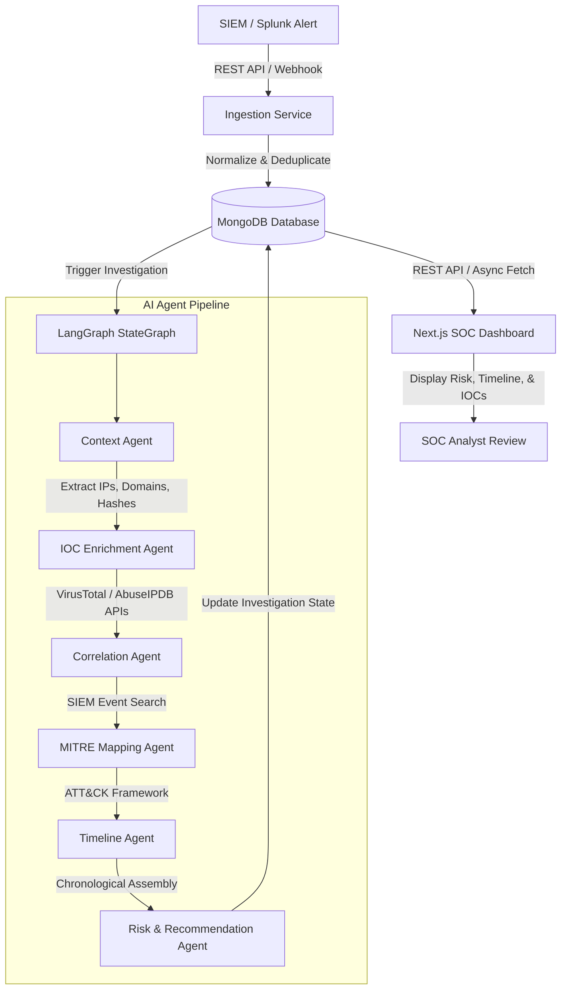

# 🛡️ Forensiq 
**AI-Agent Driven Security Operations & Investigation Platform**


**Forensiq** is an end-to-end AI-Agent Driven Security Operations Center (SOC) platform designed to eliminate alert fatigue, resolve manual investigation bottlenecks, and accelerate threat response. By deploying an automated, multi-agent AI pipeline using LangGraph, Forensiq ingests, enriches, correlates, and analyzes security alerts in real-time.

---

## 🎯 The Problem & Our Solution

### The Problem
Traditional SOC teams face thousands of security alerts daily from SIEM tools like Splunk. Analysts spend hours manually searching logs, querying threat intelligence feeds (VirusTotal, AbuseIPDB), mapping attack patterns to the MITRE ATT&CK framework, and writing incident reports.

### The Forensiq Solution
Forensiq automates the entire triage and investigation pipeline:
1. **Ingest Alerts** directly from SIEM platforms (Splunk).
2. **Orchestrate AI Agents** using **LangGraph** to autonomously extract indicators of compromise (IOCs), query threat intel feeds, map attack tactics, and calculate risk.
3. **Single-Pane-of-Glass Dashboard** built with Next.js for SOC analysts to review AI findings, attack timelines, and actionable recommendations.
4. **Automated Evidence Generation** for leadership and audit trails.

---

## 🏗️ System Architecture & Workflow

Forensiq is built as a clean monorepo containing a Python FastAPI backend and a Next.js frontend.


```mermaid
flowchart TD
    A[SIEM / Splunk Alert] -->|REST API / Webhook| B[Ingestion Service]
    B -->|Normalize & Deduplicate| C[(MongoDB Database)]
    C -->|Trigger Investigation| D[LangGraph StateGraph]
    
    subgraph AI Agent Pipeline
        D --> E[Context Agent]
        E -->|Extract IPs, Domains, Hashes| F[IOC Enrichment Agent]
        F -->|VirusTotal / AbuseIPDB APIs| G[Correlation Agent]
        G -->|SIEM Event Search| H[MITRE Mapping Agent]
        H -->|ATT&CK Framework| I[Timeline Agent]
        I -->|Chronological Assembly| J[Risk & Recommendation Agent]
    end
    
    J -->|Update Investigation State| C
    C -->|REST API / Async Fetch| K[Next.js SOC Dashboard]
    K -->|Display Risk, Timeline, & IOCs| L[SOC Analyst Review]
```

---

## 🧩 Detailed Pipeline Breakdown

### 1. SIEM Integration & Alert Ingestion
* **Protocol Abstraction**: A `SIEMProvider` interface allows seamless switching between Splunk, Elastic, Microsoft Sentinel, or QRadar.
* **Splunk Client**: Wraps Splunk's REST API, creates search jobs, polls for results, and normalizes raw Splunk events into a canonical schema.
* **Ingestion Service**: Fetches alerts, extracts critical host/user attributes, prevents duplicates, and saves canonical alert objects into MongoDB.

### 2. AI Agent Pipeline (LangGraph)
The core intelligence engine uses **LangGraph** to pass state sequentially across specialized AI agents:
* **Context Agent**: Parses raw payloads to extract IPs, domains, query names, user IDs, hostnames, and process IDs.
* **IOC Enrichment Agent**: Asynchronously queries external threat intel (e.g., VirusTotal API) to calculate threat scores (0-100) and assign reputation tags.
* **Detection Rules Engine**: Maps detection rules and behaviors directly to MITRE ATT&CK tactics (e.g., Execution, Persistence, Command & Control).

### 3. Backend API Layer (FastAPI)
The backend exposes structured REST endpoints (`/api/v1/alerts/`):
* Fetches alerts sorted by recency.
* Seeds mock alerts for local UI testing.
* Triggers live ingestion and investigation pipelines.

### 4. Frontend SOC Workspace (Next.js)
A robust Next.js 15 App Router interface featuring:
* **SOC Overview**: KPI metric cards (Total Alerts, AI Confidence, MTTD) and interactive alert trend charts.
* **Investigation View**: Dedicated workspace showing alert details, IOC tables, and AI confidence badges.

---

## 🚀 Getting Started (From Scratch)

### Prerequisites
Ensure you have the following installed on your machine:
- **Python 3.11+**
- **Node.js 18+ & npm**
- **MongoDB** (Local installation)
- **Splunk Enterprise** (Local or Remote)
- **Git**

### 1. Clone & Environment Setup
1. Clone the repository:
   ```bash
   git clone https://github.com/your-username/Forensiq.git
   cd Forensiq
   ```
2. Navigate to the `backend` directory and set up your environment variables:
   ```bash
   cd backend
   cp .env.example .env
   ```
3. Open the `.env` file and configure your keys and credentials (see Integration sections below).

### 2. Backend Setup (FastAPI & LangGraph)
1. Create a Python virtual environment:
   ```bash
   python -m venv venv
   # On Windows:
   .\venv\Scripts\activate
   # On macOS/Linux:
   source venv/bin/activate
   ```
2. Install dependencies:
   ```bash
   pip install -r requirements.txt
   ```
3. Start the backend server:
   ```bash
   python -m uvicorn app.main:app --port 8001 --reload
   ```

### 3. Frontend Setup (Next.js)
1. Open a new terminal and navigate to the `frontend` directory:
   ```bash
   cd frontend
   ```
2. Install dependencies:
   ```bash
   npm install
   ```
3. Start the frontend development server:
   ```bash
   npm run dev
   ```
4. Access the Forensiq Dashboard at `http://localhost:3000`.

*(Alternatively, on Windows, you can run `.\run_project.ps1` from the root to start both backend and frontend automatically).*

---

## 🔌 Integrations

### MongoDB Integration
Forensiq uses MongoDB to store normalized alerts and AI investigation states.
1. **Install MongoDB**: Download and install MongoDB Community Server from the [official website](https://www.mongodb.com/try/download/community).
2. **Configure Backend**: In your `backend/.env` file, set the MongoDB connection string:
   ```env
   FORENSIQ_MONGO_URI=mongodb://localhost:27017
   FORENSIQ_MONGO_DB_NAME=forensiq
   ```
3. **Sharing Data with Team Members (Optional)**: If you want to share your existing alerts and investigation data with new team members, you can dump your local database and have them restore it using the provided Python scripts:
   - **To export (on your machine):**
     Ensure your backend virtual environment is active, then run:
     ```bash
     cd backend
     python scripts/export_db.py
     ```
     Zip the newly created `mongo_dump_json` folder and share it with your team.
   - **To import (on a team member's machine):**
     Extract the zip file into the `backend` directory so that the folder `mongo_dump_json` is present. Ensure your backend virtual environment is active, then run:
     ```bash
     cd backend
     python scripts/import_db.py
     ```

### Splunk Integration
Forensiq ingests real-time alerts from Splunk and can also deploy dashboards back to it.
1. **Install Splunk**: Download Splunk Enterprise from the [official website](https://www.splunk.com/en_us/download/splunk-enterprise.html). Install and start the service (typically runs on `http://localhost:8000`).
2. **Configure Backend**: In your `backend/.env` file, provide your Splunk credentials and host:
   ```env
   SPLUNK_HOST=localhost
   SPLUNK_PORT=8089
   SPLUNK_USERNAME=admin
   SPLUNK_PASSWORD=your_splunk_password
   ```
3. **Deploy Splunk Dashboards (Optional)**: Deploy Forensiq's custom alerts and dashboards to your Splunk instance:
   ```bash
   cd backend
   python scripts/deploy_human_friendly_alerts.py
   ```

---

## 🔄 Ingestion pipeline

The backend poller (single instance, guarded by a Mongo lease) turns Splunk rows into alerts in a fixed flow:

raw Splunk row -> `CanonicalEvent` (normalization) -> noise suppression -> detection rules -> dedup -> idempotent upsert into `alerts`.

- **Cursor and pagination**: each cycle resumes from a stored cursor with a small overlap (`INGEST_OVERLAP_SECONDS`) and pages through results (`INGEST_PAGE_SIZE`, `INGEST_MAX_PAGES`); the first run looks back `INGEST_INITIAL_LOOKBACK_HOURS`.
- **Noise policy**: `backend/config/noise.yaml` (path set by `NOISE_CONFIG_PATH`) lists what is suppressed as known-benign. Suppression is never silent: every suppressed event is counted per reason in the cycle's `ingestion_runs` document.
- **Dedup**: repeated detections collapse per `INGEST_DEDUP_BUCKET_SECONDS`; failed-logon bursts raise an alert at `BRUTE_FORCE_THRESHOLD` per bucket and source.
- **Other settings**: `INVESTIGATION_CONCURRENCY` bounds concurrent auto-investigations; `POLLER_LEASE_TTL_SECONDS` is the single-poller lease TTL.
- **Health endpoint**: `GET /api/v1/dashboard/ingestion-health` returns the caller-tenant's last run, up to 20 recent runs (fetched, suppressed by reason, new/seen alerts, truncation, lag, errors) and aggregate totals. Run records expire after 30 days.
- **Regenerating test fixtures**: from `backend/`, run `./venv/Scripts/python.exe scripts/export_fixture_rows.py` to re-export real rows per EventCode from the lab dump into `tests/fixtures/splunk_rows.json`.

---

## 📖 Additional Documentation
For deeper technical specifications, refer to the following:
- [Backend Documentation](./backend/README.md)
- [Frontend Documentation](./frontend/README.md)
- [Detailed Implementation Plan](./implementation_plan.md)
- [UI Design Specification](./design.md)
